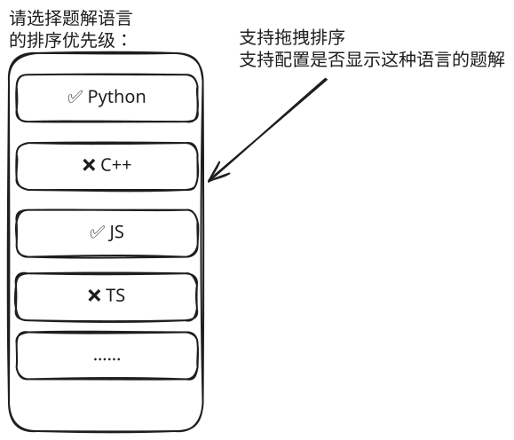

## 1. 本节内容

这一节是对 github 开源项目 hello-algo 的简介。

关于 hello-algo 的质量就不多说了，看 star 数量（100k ↑）就晓得了。

阅读体验设计得很不错，有很多值得学习的点，可以学习学习，在 TNotes.xxx 中也实现类似的效果。

## 2. `hello-algo` 简介

这篇笔记介绍的 `hello-algo` 是一个在 github 上开源的数据结构与算法的教程。

- 截止目前（25.08）：`116K star`
- 《Hello 算法》：动画图解、一键运行的数据结构与算法教程。
- 支持 Python, Java, C++, C, C#, JS, Go, Swift, Rust, Ruby, Kotlin, TS, Dart 代码。

主要内容：


## 3. 对 `tnotesjs/tnotes` 来说，都有哪些值得学习的阅读体验设计？

阅读体验很棒 👍，有很多值得学习的点，比如：

```mindmap [一些值得学习的点]
- Swiper
  - 步骤图解具备类似 Swiper tab 的切换体验，在每一张步骤图解有 tab title
  - `tnotesjs/tnotes` 中实现的 Swiper 切换效果就是参考 hello-algo 的效果来实现的
- 多语言同步切换
  - 对于 code-blocks，支持多语言，并且多语言的切换也是同步的
  - 这个效果确实不错，TNotes.leetcode 上的题解也可以参考参考，前提是所有题解都有多语言的版本
  - 也可以考虑做成全局配置的形式，提供一个配置页来统一配置多语言的排序问题
    - 
- 结尾小结
  - 每一节的结尾都有【小结】，做一个【重点回顾】、常见问题记录【Q&A】
  - 这一习惯，对于书写知识库中的很多笔记都有帮助，相当于你在完成某篇笔记之后，用你自己的话对这篇文章讲了什么作一个总结，要求尽可能简洁
- 术语表
  - 在最后的附录部分提供了【术语表】，列出一些重要的名词，以及在不同的语言 `en_us`、`zh_cn` 下的一些叫法
  - 接下来在书写知识库的时候，可以丢一个全局的类似「术语表」这样的笔记，专门用于汇总这个知识库中出现的一些领域专业术语的解释说明
- 可视化运行效果
  - hello-algo 中用的好像是 py 的库来实现的，js 中好像也有对应的库可以用，可以研究一下如何在编写 `*.md` 文件内容的时候来实现可视化运行的效果
  - 感觉对于 TNotes.leetcode 来说，这个功能的优先级很低，需要进一步权衡接入这项功能的实际收益
  - 目前的观点：
    - 做好图解：通过图解直观了解算法核心
    - 配合专业工具：通过专业 IDE 工具自行打断点了解算法的运行流程
- ...
```

## 4. 引用

- [hello 算法 github 仓库][1]
- [hello 算法在线阅读][2]
- [作者 B 站 账号 - K 源算法][3]

[1]: https://github.com/krahets/hello-algo
[2]: https://www.hello-algo.com/
[3]: https://space.bilibili.com/196980
