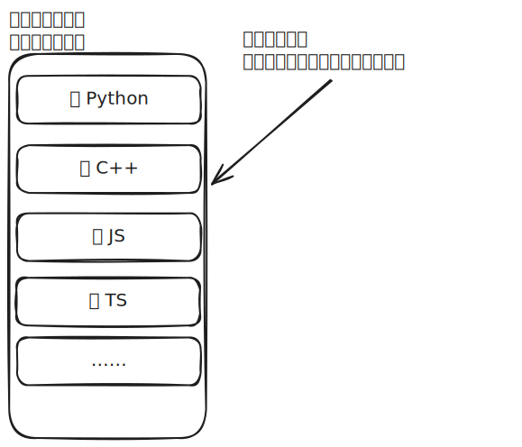

# [0001. hello-algo](https://github.com/tnotesjs/TNotes.algorithms/tree/main/notes/0001.%20hello-algo)

<!-- region:toc -->

- [1. 🫧 评论](#1--评论)
- [2. 📒 `hello-algo` 简介](#2--hello-algo-简介)
- [3. 🤔 对 TNotes.xxx 来说，都有哪些值得学习的阅读体验设计？](#3--对-tnotesxxx-来说都有哪些值得学习的阅读体验设计)
- [4. 🔗 引用](#4--引用)

<!-- endregion:toc -->

## 1. 🫧 评论

- 质量就不多说了，看 star 数量（100k ↑）就晓得了。
- 阅读体验做得很不错，有很多值得学习的点，可以学习学习，在 TNotes.xxx 中也实现类似的效果。

## 2. 📒 `hello-algo` 简介

- [hello 算法 github 仓库][1]
  - 截止目前（25.08）：`116K star`
  - 《Hello 算法》：动画图解、一键运行的数据结构与算法教程。
  - 支持 Python, Java, C++, C, C#, JS, Go, Swift, Rust, Ruby, Kotlin, TS, Dart 代码。
- 主要内容
  - 

## 3. 🤔 对 TNotes.xxx 来说，都有哪些值得学习的阅读体验设计？

阅读体验很棒 👍，有很多值得学习的点，比如：

- 步骤图解 Swiper 的切换，在头部有 title，TNotes.xxx 中实现的 Swiper 切换效果就是参考 hello-algo 的效果来实现的；
- 对于 code-blocks，支持多语言，并且多语言的切换也是同步的；
  - 这个效果确实不错，TNotes.leetcode 上的题解也可以参考参考，前提是所有题解都有多语言的版本；
  - 也可以考虑做成全局配置的形式，提供一个配置页来统一配置多语言的排序问题；
  - 
- 每一节的结尾都有【小结】，做一个【重点回顾】、常见问题记录【Q&A】。
- 在最后的附录部分提供了【术语表】，列出一些重要的名词，以及在不同的语言 `en_us`、`zh_cn` 下的一些叫法。
- 可视化运行效果
  - hello-algo 中用的好像是 py 的库来实现的，js 中好像也有对应的库可以用，可以研究一下如何在编写 `*.md` 文件内容的时候来实现可视化运行的效果；

## 4. 🔗 引用

- [hello 算法 github 仓库][1]
- [hello 算法在线阅读][2]
- [作者 B 站 账号 - K 源算法][3]

[1]: https://github.com/krahets/hello-algo
[2]: https://www.hello-algo.com/
[3]: https://space.bilibili.com/196980
