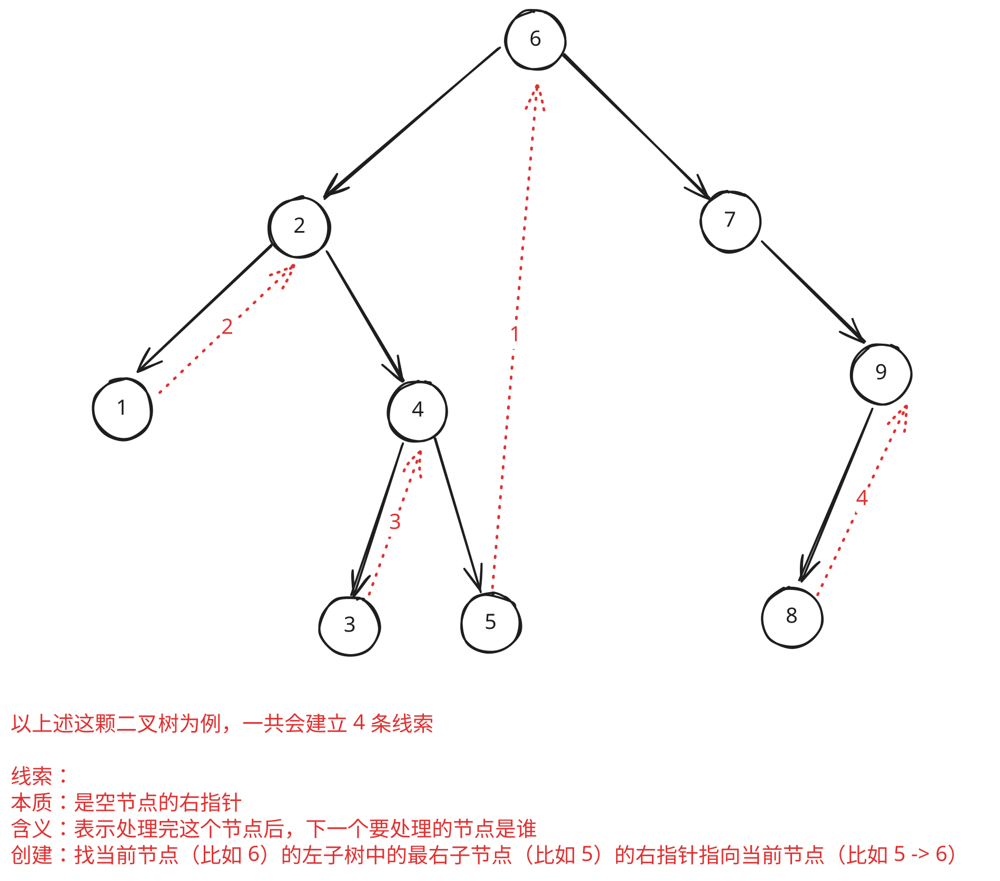

# [0007. Morris 遍历](https://github.com/tnotesjs/TNotes.algorithms/tree/main/notes/0007.%20Morris%20%E9%81%8D%E5%8E%86)

<!-- region:toc -->

- [1. 本节内容](#1-本节内容)
- [2. 评价](#2-评价)
- [3. bilibili：【Manim】Morris 中序遍历可视化（UP：RocksLi）](#3-bilibilimanimmorris-中序遍历可视化uprocksli)
- [4. Morris 遍历算法及其核心思想](#4-morris-遍历算法及其核心思想)
- [5. 为什么要使用 Morris 遍历？](#5-为什么要使用-morris-遍历)
- [6. Morris 遍历 vs. 递归/迭代遍历](#6-morris-遍历-vs-递归迭代遍历)
- [7. Morris 中序遍历 (Inorder Traversal) 的实现步骤](#7-morris-中序遍历-inorder-traversal-的实现步骤)
- [8. 相关 Leetcode 例题](#8-相关-leetcode-例题)
- [9. 引用](#9-引用)

<!-- endregion:toc -->

## 1. 本节内容

- Morris 遍历

## 2. 评价

Morris 遍历的的核心思想是：临时修改二叉树的空右指针，让遍历完左子树后能够回到当前节点。这种临时指针也叫“线索”，在学习“Morris 遍历”的时候，重点就是理解“线索”。

::: tip

可以将笔记中记录的 B 站的 Morris 中序遍历可视化的视频看一下，重点关注“线索”的建立和销毁。

:::

## 3. bilibili：【Manim】Morris 中序遍历可视化（UP：RocksLi）

<B id="BV17H4y1p7DD" />


- Current Node：当前节点
- Predecessor：前驱节点
- Finished：完成遍历的节点



线索：临时指针，也就是任意节点的左子树中的最右节点。

- 6 的前驱节点是 5（因为 6 为根的左子树中，最右节点是 5，在中序遍历时，访问完 5 之后，下一个就是访问 6）
- 2 的前驱节点是 1
- 4 的前驱节点是 3
- 9 的前驱节点是 8

## 4. Morris 遍历算法及其核心思想

- Morris 遍历算法
  - Morris 遍历算法是一种用于二叉树的遍历算法（可用于中序、前序），它能在 O(n) 时间 和 O(1) 空间内完成遍历。
  - 这意味着它不需要使用递归（避免系统调用栈）或自定义栈（避免额外空间），是真正的常数空间复杂度算法。
- 核心思想：
  - 利用树中大量空闲的叶子节点的右指针，指向其后继节点（在中序遍历序列中的下一个节点），从而在遍历完成后可以轻松回溯到上层节点。
  - 这个过程也称为“线索化”。

## 5. 为什么要使用 Morris 遍历？

- 传统的二叉树遍历方法有两种：
  1. 递归：实现简单，但空间复杂度为 O(h)（h 为树高），最坏情况下（链状树）为 O(n)。这是由于函数调用栈造成的。
  2. 迭代（使用栈）：同样，空间复杂度为 O(h)，因为需要显式地维护一个栈。
- 当树的节点数量 `n` 非常大，或者对空间效率要求极高时（例如在嵌入式系统中），O(h) 的空间开销可能是不可接受的。
- Morris 遍历完美地解决了这个 O(h) 的空间开销 问题。

## 6. Morris 遍历 vs. 递归/迭代遍历

| 特性         | Morris 遍历                        | 递归/迭代遍历    |
| :----------- | :--------------------------------- | :--------------- |
| 时间复杂度   | O(n)                               | O(n)             |
| 空间复杂度   | O(1)                               | O(h)             |
| 是否修改原树 | 是（临时修改，会恢复）             | 否               |
| 实现难度     | 较复杂                             | 简单             |
| 适用场景     | 对空间有极致要求，且允许临时修改树 | 绝大多数通用场景 |

优点：

- 极致的空间效率。

缺点：

- 算法过程稍复杂，不易理解。
- 会临时修改树的结构（虽然最后会恢复），这在并发环境下是危险的（如果其他线程同时在读这棵树，会看到错误的结构）。

## 7. Morris 中序遍历 (Inorder Traversal) 的实现步骤

- 中序遍历是最经典和常见的 Morris 遍历应用，前序和后序的步骤需要做一些调整。

下面是中序遍历的核心步骤：

```markmap 6
- 中序遍历
  - 从根节点开始，初始化 `current` 指针指向根节点。
  - 当 `current` 不为空时，循环执行以下操作：
    1. 如果 `current` 没有左子节点：
        - 访问当前节点 (`current.val`)。
        - 将 `current` 移动到其右子节点 (`current = current.right`)。
    2. 如果 `current` 有左子节点：
        - 找到 `current` 节点在中序遍历序列中的直接前驱节点。
          - 具体方法：从 `current` 的左子节点开始，一直向右遍历，直到某个节点的 `right` 指针为空 或 指向当前 `current` 节点。
          - 我们将这个节点称为 `predecessor`。
        - 判断 `predecessor` 的右指针：
          - 如果 `predecessor.right` 为空：
            - 将其右指针指向当前 `current` 节点（建立线索）。`predecessor.right = current`
            - 然后将 `current` 移动到其左子节点 (`current = current.left`)。
          - 如果 `predecessor.right` 指向当前 `current` 节点：
            - 这意味着这条线索是我们之前建立的，现在我们已经回溯回来了，说明左子树已经遍历完成。
            - 将 `predecessor` 的右指针重新置为空（断开线索，恢复树的结构）。`predecessor.right = null`
            - 访问当前节点 (`current.val`)。
            - 将 `current` 移动到其右子节点 (`current = current.right`)。
```

- 辅助理解：
  - 想象一下，这个算法像是在“攀岩”。
  - 当你想往左子树下降时，你会先扔下一根绳子（建立线索）绑在下一层的某个点（前驱节点）上。
  - 当你沿着左子树探索到底后，拉着这根绳子就能轻松回到原来的上层节点（当前节点）。
  - 回去之后，你把绳子收起来（断开线索，恢复树结构），然后继续向右子树前进。

## 8. 相关 Leetcode 例题

- [501. 二叉搜索树中的众数][3]

## 9. 引用

- [bilibili - 【Manim】Morris 中序遍历可视化][1]
- [知乎 - 神级遍历——morris][2]
- [501. 二叉搜索树中的众数][3]

[1]: https://www.bilibili.com/video/BV17H4y1p7DD/
[2]: https://zhuanlan.zhihu.com/p/101321696
[3]: https://leetcode.cn/problems/find-mode-in-binary-search-tree/description/
