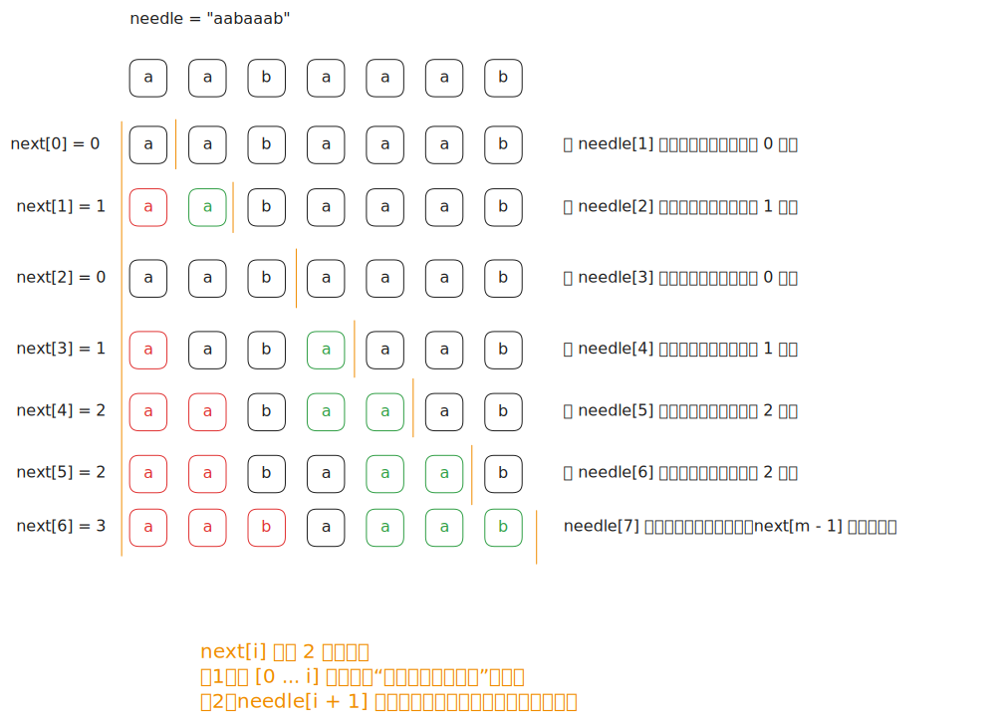

# [0014. KMP 算法](https://github.com/tnotesjs/TNotes.algorithms/tree/main/notes/0014.%20KMP%20%E7%AE%97%E6%B3%95)

<!-- region:toc -->

- [1. 🎯 本节内容](#1--本节内容)
- [2. 🫧 评价](#2--评价)
- [3. 🤔 考察 KMP 算法的 LeetCode 例题都有哪些？](#3--考察-kmp-算法的-leetcode-例题都有哪些)
  - [3.1. 题目描述](#31-题目描述)
  - [3.2. 解法 1：朴素匹配](#32-解法-1朴素匹配)
  - [3.3. 解法 2：KMP](#33-解法-2kmp)
    - [核心步骤](#核心步骤)
    - [理解最长相等真前后缀](#理解最长相等真前后缀)
    - [理解 next 数组的作用](#理解-next-数组的作用)
  - [3.4. 对比：两种解法](#34-对比两种解法)
- [4. 🤔 KMP 是什么？](#4--kmp-是什么)
- [5. 🤔 KMP 相关的专业术语都有哪些？](#5--kmp-相关的专业术语都有哪些)
  - [5.1. `next` 数组的不同叫法](#51-next-数组的不同叫法)
  - [5.2. KMP 算法其他相关术语](#52-kmp-算法其他相关术语)

<!-- endregion:toc -->

## 1. 🎯 本节内容

- KMP 算法
- KMP 算法相关术语
- LeetCode 例题 `28. 实现 strStr()` 详解

## 2. 🫧 评价

用一句话来描述 KMP 算法的核心：构建并维护 next 数组，利用已匹配的信息避免重复比较。

这篇笔记将以 LeetCode 例题 `28. 实现 strStr()` 为引子来介绍 KMP 算法，不过这道题本身是一道简单题，使用朴素匹配的做法完全没问题，而且从 LeetCode 官方提交结果来看，暴力的做法反而更好。（这也告诉我们 => 算法的选择应结合当前应用场景下实际数据的特征来定）

## 3. 🤔 考察 KMP 算法的 LeetCode 例题都有哪些？

以下是 LeetCode 上和 KMP 算法相关的一些例题：

- `28. 实现 strStr()`
- `214. 最短回文串`
- `459. 重复的子字符串`
- `686. 重复叠加字符串匹配`
- `1392. 最长快乐前缀`
- `2851. 字符串转换`
- `3008. 找出数组中的美丽下标 II`
- `3036. 匹配模式数组的子数组数目 II`
- `3009. 折线图上的最大交点数量`

::: tip

为了方便介绍 KMP 算法，这里以 `28. 实现 strStr()` 为示例加以说明，其他例题可以在刷完这篇笔记之后，再去找来练手巩固！

下面将通过对比两种解法（朴素匹配 vs. KMP 算法）来认识 KMP 算法的核心优化点（失配的时候无需暴力重头来过，会依据 next 数组记录的值来决定下次的开始匹配位置）。

:::

### 3.1. 题目描述

- [leetcode](https://leetcode.cn/problems/find-the-index-of-the-first-occurrence-in-a-string/)

给你两个字符串 `haystack` 和 `needle` ，请你在 `haystack` 字符串中找出 `needle` 字符串的第一个匹配项的下标（下标从 0 开始）。如果 `needle` 不是 `haystack` 的一部分，则返回 `-1`。

---

示例 1：

```txt
输入：haystack = "sadbutsad", needle = "sad"
输出：0
```

解释：

"sad" 在下标 0 和 6 处匹配。

第一个匹配项的下标是 0，所以返回 0 。

---

示例 2：

```txt
输入：haystack = "leetcode", needle = "leeto"
输出：-1
```

解释："leeto" 没有在 "leetcode" 中出现，所以返回 -1。

---

提示：

- `1 <= haystack.length, needle.length <= 10^4`
- `haystack` 和 `needle` 仅由小写英文字符组成

### 3.2. 解法 1：朴素匹配

```py
class Solution:
    def strStr(self, haystack: str, needle: str) -> int:
        n, m = len(haystack), len(needle)

        if m == 0:
            return 0

        for i in range(n - m + 1):
            j = 0
            while j < m and haystack[i + j] == needle[j]:
                j += 1
            if j == m:
                return i

        return -1
```

- 时间复杂度：$O(n \times m)$，其中 $n$ 和 $m$ 分别是 haystack 和 needle 的长度，最坏情况下每个起点都要完整比较一次 needle
- 空间复杂度：$O(1)$，只使用了常数级别的额外空间

算法思路：

- 枚举 haystack 中所有可能的匹配起点，起点范围是 $[0, n - m]$
- 对每个起点继续逐字符比较 `haystack[i + j]` 和 `needle[j]`
- 一旦出现失配，立即结束当前起点的检查并尝试下一个起点
- 如果某个起点能连续匹配完全部 $m$ 个字符，那么它就是第一个匹配项的下标

### 3.3. 解法 2：KMP

```py
class Solution:
    def strStr(self, haystack: str, needle: str) -> int:
        n, m = len(haystack), len(needle)

        if m == 0:
            return 0

        next = [0] * m
        j = 0
        for i in range(1, m):
            while j > 0 and needle[i] != needle[j]:
                j = next[j - 1]
            if needle[i] == needle[j]:
                j += 1
            next[i] = j

        j = 0
        for i, ch in enumerate(haystack):
            while j > 0 and ch != needle[j]:
                j = next[j - 1]
            if ch == needle[j]:
                j += 1
            if j == m:
                return i - m + 1

        return -1
```

- 时间复杂度：$O(n + m)$，其中 $n$ 和 $m$ 分别是 haystack 和 needle 的长度，构建 next 数组需要 $O(m)$，匹配过程只需线性扫描 haystack 一次
- 空间复杂度：$O(m)$，需要额外的 next 数组存储模式串的前缀信息

算法思路：

- 先为 needle 构建 next 数组，`next[i]` 表示子串 `needle[0...i]` 的最长相等真前后缀长度
- 匹配时同时扫描 haystack 和 needle，字符相等就让两个指针一起前进
- 如果发生失配，不是直接暴力回退 haystack 指针到位置 0，而是利用 next 数组把 needle 指针跳到上一个可复用的位置
- 当 needle 指针走到长度 $m$ 时，说明已经找到完整匹配，起始下标就是当前下标减去 $m - 1$

#### 核心步骤

- 步骤 1. 初始化 next 数组
  - 这部分代码构建了 PMT（或称 next 数组）
  - 通过遍历模式串，计算每个位置的 最大相同前后缀长度，从而指导后续匹配时如何移动模式串
- 步骤 2. 匹配过程
  - 使用两个指针 i 和 j 分别遍历主串和模式串
  - 匹配：两个指针都向前移动
  - 不匹配：模式串指针 j 会根据 next 数组进行调整，以尝试新的匹配位置
  - 如果模式串完全匹配，则返回匹配的起始位置

#### 理解最长相等真前后缀

想要充分理解下面这句话，必须理解“最长相等真前后缀”是什么。

> `next[i]` 表示子串 `needle[0...i]` 的最长相等真前后缀长度。

术语“最长相等真前后缀”拆解：

| 部分           | 含义                           |
| -------------- | ------------------------------ |
| 前缀           | 从字符串开头取的子串           |
| 后缀           | 从字符串末尾取的子串           |
| 真（关键限定） | 前缀和后缀都不能等于字符串本身 |
| 相等           | 前缀和后缀内容相同             |
| 最长           | 所有符合条件中长度最大的       |

#### 理解 next 数组的作用

理解 next 是理解 KMP 算法的关键。

以下是一些 `needle` 和对应的 `next` 数组示例：

- `needle = "sad"` => `next = [0, 0, 0]`
- `needle = "leeto"` => `next = [0, 0, 0, 0, 0]`
- `needle = "ababca"` => `next = [0, 0, 1, 2, 0, 1]`
- `needle = "aabaaab"` => `next = [0, 1, 0, 1, 2, 2, 3]`

这里以最后一个示例 `needle = "aabaaab"` 为例，看看 next 数组 `[0, 1, 0, 1, 2, 2, 3]` 是如何构建出来的：



初始化 next 数组的具体代码实现：

```py
next = [0] * m
j = 0
for i in range(1, m):
    while j > 0 and needle[i] != needle[j]:
        j = next[j - 1]
    if needle[i] == needle[j]:
        j += 1
    next[i] = j
```

从题解来看，会发现 next 数组在初始化之后就是只读了的。

我们构建 next 数组的核心目的就是为了解决当 `needle[i + 1]` 失配时，直接暴力从头 `0` 开始重新匹配的问题，更好的做法是回退到 `next[i]` 位置，从而减少一些不必要的重复查找流程。

### 3.4. 对比：两种解法

解法 2 的 KMP 算法对解法 1 的朴素匹配做了优化，如果发现不匹配的情况，不会暴力地直接回溯到子串的开头位置，而是根据 next 中记录的索引来决定当本次匹配失败时，下次匹配开始的位置应该是哪。

KMP 算法通过预处理模式串构建 next 数组记录最大相同前后缀长度，匹配失败时根据 next 数组智能移动模式串指针，避免重复比较，将时间复杂度优化到线性。

KMP 的优势在于时间维度上的优化，对于 LeetCode 上的这道题而言，官方提供的示例其实无法体现出 KMP 的优势，两种解法的耗时基本相近，反而 KMP 多维护了一个 next 数组，导致空间消耗更大。

::: swiper


:::

::: tip

两种解法执行用时相同，说明 LeetCode 的测试用例中模式串较为简单，并没有专门针对 KMP 算法的特点去设计测试的数据集。

这个提交结果其实也告诉我们 => 在追求更优算法之前，不防先看看我们当下应用场景的数据特征。

以本题为例，若测试用例的模式串中很少出现类似 `AAAABBAAA` 这样大量连续重复的模式串，更多出现的是类似 `ABCDEF...` 这样几乎不重复的模式串时，KMP 的优化就非常有限了。

| 模式串类型 | next 数组特征 | KMP 优化效果 |
| --- | --- | --- |
| `AAAABBAAA`（大量重复） | next 值较大，可跳过多次比较 | 明显 |
| `ABCDEF...`（几乎无重复） | next 值基本为 0，失配只能回退到开头 | 有限 |

综上，算法选择应结合实际数据特征，并非所有场景下更"高级"的算法都能带来收益。对于模式串较简单、重复模式较少的情况，朴素匹配反而更省空间，效果相当。

:::

## 4. 🤔 KMP 是什么？

KMP（Knuth-Morris-Pratt）算法是一种高效的字符串匹配算法，由 Donald Knuth、Vaughan Pratt 和 James H. Morris 独立发明，并于 1977 年发表。这种算法的主要优点在于它能够在线性时间内完成模式串在文本串中的查找，即其时间复杂度为 $O(n+m)$，其中 $n$ 是文本串（haystack）的长度，$m$ 是模式串（needle）的长度。

KMP 算法的核心在于利用已经匹配过的信息，避免从头开始重新匹配。当模式串的一个位置与主串不匹配时，KMP 算法可以知道之前已经匹配过的字符信息，并据此决定模式串应该移动的位置，而不是简单地将模式串向后移动一位。

KMP 算法因其高效性和实用性，在文本处理、搜索引擎等领域有着广泛的应用。通过预处理模式串，KMP 能够在最坏情况下也能保证线性时间复杂度，这使得它成为解决字符串匹配问题的一个非常优秀的算法。

## 5. 🤔 KMP 相关的专业术语都有哪些？

### 5.1. `next` 数组的不同叫法

核心数据结构 `next` 数组的不同叫法：

| 术语      | 全称                         | 说明                            |
| --------- | ---------------------------- | ------------------------------- |
| PMT       | Partial Match Table          | 部分匹配表，即 next 数组        |
| LPS       | Longest Proper Prefix Suffix | 最长真前缀后缀数组              |
| 前缀函数  | Prefix Function              | 记作 π(i)，学术论文中的标准称呼 |
| 失败函数  | Failure Function             | 失配时使用的跳转表              |
| next 数组 | -                            | 国内教材常用称呼                |
| 跳转表    | Jump Table                   | 直观描述其功能                  |
| ...       | ...                          | ...                             |

::: tip

这些名称本质上指的是同一个东西（上述解法 2 中的 next 数组），只是不同教材、不同地区的叫法不同。

:::

### 5.2. KMP 算法其他相关术语

| 术语           | 含义                                             |
| -------------- | ------------------------------------------------ |
| KMP            | 以三位发明者命名：Knuth、Morris、Pratt（1977年） |
| 文本串         | Text / Haystack，被搜索的长串，也称为主串        |
| 模式串         | Pattern / Needle，要查找的短串，也称为子串       |
| 真前缀         | Proper Prefix，不包含字符串本身的前缀            |
| 真后缀         | Proper Suffix，不包含字符串本身的后缀            |
| 失配           | Mismatch，当前字符不匹配                         |
| 回退           | Fallback，失配时指针跳转到更短的可复用前缀       |
| 有限状态自动机 | Finite State Machine，KMP 的另一种理解视角       |

::: tip

- 学习一个短语 => Find needle in haystack 大海捞针
- 顾名思义 => 从 haystack 中找 needle

:::
