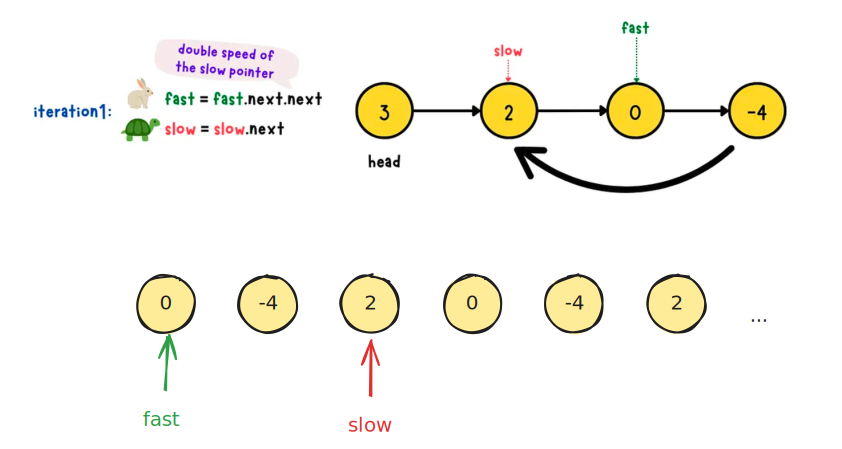

# [0019. Floyd 判圈算法](https://github.com/tnotesjs/TNotes.algorithms/tree/main/notes/0019.%20Floyd%20%E5%88%A4%E5%9C%88%E7%AE%97%E6%B3%95)

<!-- region:toc -->

- [1. 🎯 本节内容](#1--本节内容)
- [2. 🫧 评价](#2--评价)
- [3. 🤔 Floyd 判圈算法是什么？](#3--floyd-判圈算法是什么)
- [4. 🤔 Floyd 判圈算法的「判圈原理」是什么？](#4--floyd-判圈算法的判圈原理是什么)
  - [4.1. 为什么在有环时一定会相遇？](#41-为什么在有环时一定会相遇)
    - [情况 1：入圈时两指针在同一位置](#情况-1入圈时两指针在同一位置)
    - [情况 2：入圈时两指针不在同一位置](#情况-2入圈时两指针不在同一位置)
  - [4.2. 复杂度分析](#42-复杂度分析)
- [5. 🤔 环的起点是什么？](#5--环的起点是什么)
- [6. 🤔 Floyd 判圈算法的「找环的起点原理」是什么？](#6--floyd-判圈算法的找环的起点原理是什么)
  - [6.1. 定义变量](#61-定义变量)
  - [6.2. 推导过程](#62-推导过程)
  - [6.3. 算法步骤](#63-算法步骤)
  - [6.4. 复杂度分析](#64-复杂度分析)
- [7. 🤔 Floyd 判圈算法的主要应用场景都有哪些？](#7--floyd-判圈算法的主要应用场景都有哪些)
- [8. 🤔 LeetCode 上对应的算法题有哪些？](#8--leetcode-上对应的算法题有哪些)
- [9. 🔗 引用](#9--引用)

<!-- endregion:toc -->

## 1. 🎯 本节内容

- Floyd 判圈算法

## 2. 🫧 评价

Floyd 判圈算法的核心：快慢指针 + 数学推导

- 判圈部分很好理解，快指针追慢指针，必定相遇
- 找环入口的数学推导 $a = (k-1)L + c$ 需要理解透彻，属于是面试常考
  - 记住一个口诀 👉 “相遇后重置一个指针到头，然后同速前进，再次相遇即为环入口”
  - 空间复杂度 $O(1)$ 是亮点，面试官可能会问为什么不用哈希表（因为空间换时间不是最优解）

## 3. 🤔 Floyd 判圈算法是什么？

Floyd 判圈算法（Floyd's Cycle-Finding Algorithm，也叫"龟兔赛跑算法"）是一个用于检测链表中是否存在环，并且可以找到环的起点的经典算法。它的核心思想是使用两个指针，以不同的速度在链表中移动，通过它们的相遇来判定环的存在。

## 4. 🤔 Floyd 判圈算法的「判圈原理」是什么？

以 `[3, 2, 0, -4]` 为例：


- 两个指针：`slow`（龟）每次走 1 步，`fast`（兔）每次走 2 步
- 从头节点同时出发
- 如果链表无环，`fast` 会先到达 `null`
- 如果链表有环，`fast` 会和 `slow` 在环中某处相遇

### 4.1. 为什么在有环时一定会相遇？

下面我们以慢指针入圈儿时的两种不同情况来讨论。

#### 情况 1：入圈时两指针在同一位置

如果慢指针入圈时两指针在同一位置，意味着当慢指针入环的时候，两者就相撞了，这其实已经证明了环存在，无需再走后续流程。

#### 情况 2：入圈时两指针不在同一位置

这种情况就可以看作 `fast` 在追赶 `slow`。

- 在环内，`fast` 与 `slow` 的相对速度是 `1` 步/单位时间
- 设它们进入环时相距 `d` 步，并且 `d` 一定小于环的长度 `L`
- 那么 `fast` 追上 `slow` 需要的时间就是 `d` 单位时间，因此它们必定在环内相遇，不会错过



当 `slow` 入圈的时候，我们可以将此时 `fast` 所在位置视作起点，终点就是 `fast` 的前一个位置，得到线段 `0 -4 2`。`slow`、`fast` 两个指针会在环中不断地移动，直到两者相撞。这就好比它们在一段由无数个 `0 -4 2` 线段组成的无穷长的直线上的"龟兔赛跑"，`fast` 每次比 `slow` 多走 `1` 步，因此它们最终一定会相撞。

### 4.2. 复杂度分析

- 时间复杂度：$O(n)$
  - 最坏情况下，`slow` 需要走完整个链表才能进入环，即 $O(n)$ 步
  - 进入环后，`fast` 追上 `slow` 最多需要环长的时间，而环长不超过 $n$，因此也是 $O(n)$ 步
  - 总体时间复杂度为 $O(n)$
- 空间复杂度：$O(1)$
  - 只使用了两个指针变量 `slow` 和 `fast`，不需要额外的存储空间

## 5. 🤔 环的起点是什么？

环的起点其实就是环的入口，举个例子：

```
链表: 1 → 2 → 3 → 4 → 5
              ↑       ↓
              8 ← 7 ← 6

节点 3 是环的起点
```

## 6. 🤔 Floyd 判圈算法的「找环的起点原理」是什么？

这是 Floyd 判圈算法最精妙的部分。为了找到环的起点，我们需要建立一个数学关系。

### 6.1. 定义变量

- $a$：链表头到环入口的距离
- $b$：环入口到第一次相遇点的距离
- $c$：第一次相遇点再走到环入口的距离（环的另一部分）
- $L$：环的长度，$L = b + c$

### 6.2. 推导过程

当 `slow` 和 `fast` 第一次在环中相遇时：

- `slow` 走的步数：$a + b$
- `fast` 走的步数：$a + b + kL$（其中 $k$ 是某个正整数，表示 `fast` 已经在环里多走了 $k$ 圈）

因为 `fast` 的速度是 `slow` 的两倍，所以有：

$$
\begin{aligned}
2(a + b) &= a + b + kL \\
\Rightarrow a + b &= kL \\
\Rightarrow a &= kL - b \\
  &= k(b + c) - b \\
  &= (k-1)b + kc \\
  &= (k-1)(b + c) + c \\
  &= (k-1)L + c
\end{aligned}
$$

上述推导得出了以下关键结论：

从链表头到环入口的距离 $a$，等于从第一次相遇点再走 $c$ 步加上若干圈环的长度 $(k-1)L$。由于 $(k-1)L$ 表示在环内绕整数圈，最终会回到原位置，这部分的偏移对找环入口没有影响。

- 走法 1：从链表头走 $a$ 步
- 走法 2：从第一次相遇点走 $c$ 步

两种走法都会到达环的入口！

### 6.3. 算法步骤

基于上述数学推导，我们可以设计出找环入口的具体步骤：

1. 重置指针：当 `fast` 和 `slow` 第一次相遇后，将其中一个指针（通常选择 `fast`）重新指向链表头节点
2. 同步前进：将两个指针的速度都改为每次走 1 步
3. 再次相遇：当两个指针再次相遇时，相遇点就是环的入口

```javascript
function detectCycle(head) {
  if (!head || !head.next) {
    return null
  }

  let slow = head
  let fast = head

  // 第一步：检测是否有环
  while (fast && fast.next) {
    slow = slow.next
    fast = fast.next.next
    if (slow === fast) {
      break
    }
  }

  // 如果 fast 为 null，说明无环
  if (!fast || !fast.next) {
    return null
  }

  // 第二步：找环的入口
  fast = head
  while (slow !== fast) {
    slow = slow.next
    fast = fast.next
  }

  return slow // 环入口
}
```

让我们详细分析为什么这个方法是正确的：

初始状态：

- 指针 A（重置后的 `fast`）在链表头，距离环入口 $a$ 步
- 指针 B（`slow`）在第一次相遇点，距离环入口 $c$ 步

移动过程：

- 两个指针都以每次 1 步的速度前进
- 指针 A 走 $a$ 步后到达环入口
- 指针 B 走 $a$ 步，实际上就是走 $c + (k-1)L$ 步（根据 $a = c + (k-1)L$）
  - 先走 $c$ 步到达环入口
  - 然后在环内继续走 $(k-1)L$ 步，相当于绕环 $k-1$ 圈
  - 最终仍然停在环入口

结论： 经过 $a$ 步后，两个指针都会到达环入口，因此它们会在环入口处相遇。

### 6.4. 复杂度分析

- 时间复杂度：$O(n)$
  - 从链表头到环入口的距离最多为 $n$，即 $a \leq n$
  - 两个指针同步移动，最多走 $a$ 步就会在环入口相遇
  - 因此时间复杂度为 $O(n)$
- 空间复杂度：$O(1)$
  - 只使用了两个指针变量，不需要额外的存储空间

## 7. 🤔 Floyd 判圈算法的主要应用场景都有哪些？

1. 链表环检测
2. 在迭代函数中寻找循环（如伪随机数生成器的周期检测）
3. 有时也用于图算法中检测循环依赖

## 8. 🤔 LeetCode 上对应的算法题有哪些？

- [142. 环形链表 II][2] -> 直接应用 Floyd 判圈算法找环的入口
- [141. 环形链表][3] -> 使用 Floyd 判圈算法判断链表是否有环
- [287. 寻找重复数][4] -> 将数组抽象为链表后使用 Floyd 判圈算法

## 9. 🔗 引用

- [Medium - Claire Lee - Floyd's Cycle Detection Algorithm][1]
- [LeetCode 142. 环形链表 II][2]
- [LeetCode 141. 环形链表][3]
- [LeetCode 287. 寻找重复数][4]

[1]: https://yuminlee2.medium.com/floyds-cycle-detection-algorithm-b27ed50c607f
[2]: https://leetcode.cn/problems/linked-list-cycle-ii/
[3]: https://leetcode.cn/problems/linked-list-cycle/
[4]: https://leetcode.cn/problems/find-the-duplicate-number/
