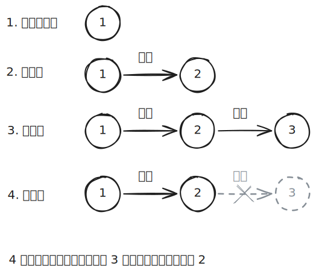

# [0034. 回溯](https://github.com/tnotesjs/TNotes.algorithms/tree/main/notes/0034.%20%E5%9B%9E%E6%BA%AF)

<!-- region:toc -->

- [1. 🎯 本节内容](#1--本节内容)
- [2. 🫧 评价](#2--评价)
- [3. 🤔 回溯算法是什么？](#3--回溯算法是什么)
- [4. 🤔 什么是「尝试与回退」？](#4--什么是尝试与回退)
- [5. 🤔 什么是「剪枝」？](#5--什么是剪枝)
- [6. 🤔 回溯算法的「框架代码」是什么样的？](#6--回溯算法的框架代码是什么样的)
- [7. 🤔 回溯算法有哪些「常用术语」？](#7--回溯算法有哪些常用术语)
- [8. 🤔 回溯算法的「优点与局限性」是什么？](#8--回溯算法的优点与局限性是什么)
- [9. 🤔 回溯算法的「典型例题」有哪些？](#9--回溯算法的典型例题有哪些)
- [10. 🔗 引用](#10--引用)

<!-- endregion:toc -->

## 1. 🎯 本节内容

- todo

## 2. 🫧 评价

- todo

## 3. 🤔 回溯算法是什么？

回溯算法（backtracking algorithm）是一种通过穷举来解决问题的方法，它的核心思想是从一个初始状态出发，暴力搜索所有可能的解决方案，当遇到正确的解则将其记录，直到找到解或者尝试了所有可能的选择都无法找到解为止。

## 4. 🤔 什么是「尝试与回退」？

之所以称之为回溯算法，是因为该算法在搜索解空间时会采用“尝试”与“回退”的策略。当算法在搜索过程中遇到某个状态无法继续前进或无法得到满足条件的解时，它会撤销上一步的选择，退回到之前的状态，并尝试其他可能的选择。

- 尝试 ≈ 前进 ≈ push
- 回退 ≈ 撤销 ≈ pop

## 5. 🤔 什么是「剪枝」？

复杂的回溯问题通常包含一个或多个约束条件，约束条件通常可用于“剪枝”。根据问题的约束条件，提前减掉不需要去尝试的搜索分支，避免一些无意义的尝试，从而达到提高搜索效率的目的。

## 6. 🤔 回溯算法的「框架代码」是什么样的？

## 7. 🤔 回溯算法有哪些「常用术语」？

## 8. 🤔 回溯算法的「优点与局限性」是什么？

## 9. 🤔 回溯算法的「典型例题」有哪些？

## 10. 🔗 引用

- [回溯算法 - hello-algo][1]

[1]: https://www.hello-algo.com/chapter_backtracking/backtracking_algorithm/
